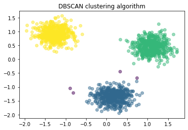

## Hands-on Practice Learning Lab for Data Science

### Overview  
* * *
This repository includes several hands on labs provided as a part of [Machine Learning with Python](https://www.coursera.org/learn/machine-learning-with-python) course, offered by [coursera.org](https://www.coursera.org/).  

The present notebook provides data analysis on several datasets using different machine learning (ML) techniques including:
* Supervised ML
    * regression models
    * classification methods
        * K nearest neighbor
        * decision tree   
        * logistic regression
        * support vector machine (SVM)
* Unsupervised ML
    * clustering
        * partition-based method (k-mean)
        * hierarchical method (Agglomerative clustering)
        * density-based method (DSSCAN method)
* Recommender system
    * content based
    * collaborative based  

 
✓ Link to the notebook: [Link](https://github.com/Farhad-Davaripour/Machine_learning_with_python/blob/main/Notebook.ipynb)   

## About The Author

- Farhad Davaripour is a finite element specialist/data science enthusiast with near 3 years of experience working in research and development roles. He has a knack for problem-solving and passion for data science (He is certified with [IBM Data Science Professional Certificate](https://coursera.org/share/d7d1a76ed251437131fd33bba91bb9d9)).
- Connect with Farhad on [LinkedIn](https://www.linkedin.com/in/farhad-davaripour/).
